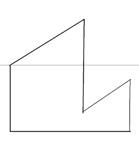
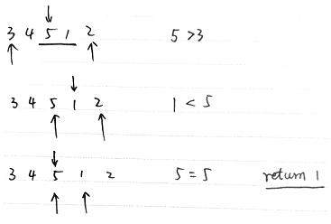
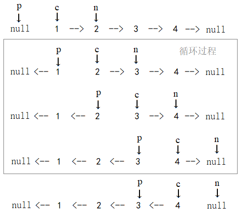

# 牛客网剑指offer

## [1. 二维数组中的查找](https://www.nowcoder.com/practice/abc3fe2ce8e146608e868a70efebf62e?tpId=13&tqId=11154&tPage=1&rp=1&ru=/ta/coding-interviews&qru=/ta/coding-interviews/question-ranking)

> 在一个二维数组中（每个一维数组的长度相同），每一行都按照从左到右递增的顺序排序，每一列都按照从上到下递增的顺序排序。请完成一个函数，输入这样的一个二维数组和一个整数，判断数组中是否含有该整数。
>

思路：该矩阵从左到右递增，从下到上递减，于是从最左下角开始，比目标大向上移动，比目标小就向右移动

```js
function Find(target, array)
{
    // write code here
    var i = array.length - 1, j = 0
    while (i >= 0 && j < array[i].length) {
        if (array[i][j] < target) {
            j++
        } else if (array[i][j] > target) {
            i--
        } else {
            return true
        }
    }
    return false
}
```

## [2. 替换空格](https://www.nowcoder.com/practice/4060ac7e3e404ad1a894ef3e17650423?tpId=13&tqId=11155&tPage=1&rp=1&ru=/ta/coding-interviews&qru=/ta/coding-interviews/question-ranking)

> 请实现一个函数，将一个字符串中的每个空格替换成“%20”。例如，当字符串为We Are Happy.则经过替换之后的字符串为We%20Are%20Happy。
>

### 法一

直接用正则

```js
function replaceSpace(str)
{
    // write code here
    return str.replace(/ /g, '%20')
}
```

### 法二

```js
function replaceSpace(str)
{
    // write code here
    var arr = str.split('')
    for (var i = 0; i < arr.length; i++) {
      if (arr[i] === ' ') {
        arr[i] = '%20'
      }
    }
    return arr.join('')
}

var str = 'We Are Happy'
console.log(replaceSpace(str))
```

## [3. 从尾到头打印链表](https://www.nowcoder.com/practice/d0267f7f55b3412ba93bd35cfa8e8035?tpId=13&tqId=11156&tPage=1&rp=1&ru=/ta/coding-interviews&qru=/ta/coding-interviews/question-ranking)

> 输入一个链表，按链表值从尾到头的顺序返回一个ArrayList。
>

思路：

1. head存在吗？head有next吗？没有就直接return []
2. 现在的node有next吗？有！那就递归。（假装现在递归执行完了，那我就得到了一个从尾开始是数组，现在我把当前node.val给push进去，在返回这个arr，给后面的递归用。）
3. 现在的node有next吗？没有！停止递归，把val给push到arr里，返回arr

```js
function printListFromTailToHead(head) {
  // 考虑边界情况
  if (!head || !head.next) return []
  // arr在递归函数外边，闭包
  var arr = []
  function pRec(node) {
    // 当node.next存在时才递归
    if (node.next !== null) {
      // 拿到递归后的arr
      arr = pRec(node.next)
    }
    // 把自己的val给push进去，返回arr
    arr.push(node.val)
    return arr
  }
  return pRec(head)
}
```

## [4. 重建二叉树](https://www.nowcoder.com/practice/8a19cbe657394eeaac2f6ea9b0f6fcf6?tpId=13&tqId=11157&tPage=1&rp=1&ru=/ta/coding-interviews&qru=/ta/coding-interviews/question-ranking)

> 输入某二叉树的前序遍历和中序遍历的结果，请重建出该二叉树。假设输入的前序遍历和中序遍历的结果中都不含重复的数字。例如输入前序遍历序列{1,2,4,7,3,5,6,8}和中序遍历序列{4,7,2,1,5,3,8,6}，则重建二叉树并返回。

思路：

1. pre = [1, 2, 4, 7, 3, 5, 6, 8]，vin = [4, 7, 2, 1, 5, 3, 8, 6]
2. 前序遍历是先遍历当前节点，再遍历左子树，然后遍历右子树
   1. 所以前序遍历的第一项就是root，root.val === 1
   2. root.left和root.right前序遍历的结果暂时未知，需要通过中序遍历的结果判定项数
3. 中序遍历是先遍历左子树，再遍历当前节点，然后遍历右子树，因为当前节点是1，所以：
   1. root.left的中序遍历结果是[4, 7,  2]，可知root.left的先序遍历是 [2, 4, 7]
   2. root.right的中序遍历结果是[5, 3, 8, 6]，可知root.right的先序遍历是 [3, 5, 6, 8]
4. 递归，递归停止的条件是pre或vin长度为0

```js
function reConstructBinaryTree(pre, vin) {
  // write code here
  if (vin.length === 0) return null
  var root = new TreeNode(pre[0])
  var rootIdxInVin = vin.indexOf(root.val)
  var vinLeft = vin.slice(0, rootIdxInVin)
  var vinRight = vin.slice(rootIdxInVin + 1, vin.length)
  var preLeft = pre.slice(1, vinLeft.length + 1)
  var preRight = pre.slice(vinLeft.length + 1, pre.length)
  root.left = reConstructBinaryTree(preLeft, vinLeft)
  root.right = reConstructBinaryTree(preRight, vinRight)
  return root
}
```

## [5. 用两个栈实现队列](https://www.nowcoder.com/practice/54275ddae22f475981afa2244dd448c6?tpId=13&tqId=11158&tPage=1&rp=1&ru=/ta/coding-interviews&qru=/ta/coding-interviews/question-ranking)

> 用两个栈来实现一个队列，完成队列的Push和Pop操作。 队列中的元素为int类型。

思路：

1. push操作很简单
2. pop的时候，除了栈底那一项，把inStack先全部导入outStack，然后inStack的栈底给pop出来，最后outStack的所有项再重新入栈

```js
var inStack = []
var outStack = []
function push(node)
{
    // write code here
    inStack.push(node)
}
function pop()
{
    // write code here
    while (inStack.length !== 1) {
        outStack.push(inStack.pop())
    }
    var res = inStack.pop()
    while (outStack.length !== 0) {
         inStack.push(outStack.pop())
    }
    return res
}
```

## [6. 旋转数组的最小数字](https://www.nowcoder.com/practice/9f3231a991af4f55b95579b44b7a01ba?tpId=13&tqId=11159&tPage=1&rp=1&ru=/ta/coding-interviews&qru=/ta/coding-interviews/question-ranking)

> 把一个数组最开始的若干个元素搬到数组的末尾，我们称之为数组的旋转。 输入一个非减排序的数组的一个旋转，输出旋转数组的最小元素。 例如数组{3,4,5,1,2}为{1,2,3,4,5}的一个旋转，该数组的最小值为1。 NOTE：给出的所有元素都大于0，若数组大小为0，请返回0。

思路：

1. 比如rotateArray是[3,4,5,1,2]，可以发现趋势是[→ 增大 →，突然减小，→ 增大 →]，类似下面这样


2. 采用二分法，只要mid项比left项大，就增大left端点；只要mid项比left小，就减小right端点，直到mid项和left项一样大，此时mid + 1项即为所求。

```js
function minNumberInRotateArray(rotateArray) {
  // write code here
  if (rotateArray.length === 0) return 0  
  var left = 0, right = rotateArray.length, mid
  while (left <= right) {
    mid = Math.floor((left + right) / 2)
    if (rotateArray[mid] > rotateArray[left]) {
      left = mid
    } else if (rotateArray[mid] < rotateArray[left]) {
      right = mid
    } else {
      return rotateArray[mid + 1]
    }
  }
}
```



## [7. 斐波那契数列](https://www.nowcoder.com/practice/c6c7742f5ba7442aada113136ddea0c3?tpId=13&tqId=11160&tPage=1&rp=1&ru=/ta/coding-interviews&qru=/ta/coding-interviews/question-ranking)

> 大家都知道斐波那契数列，现在要求输入一个整数n，请你输出斐波那契数列的第n项（从0开始，第0项为0）。
>
> n<=39

### 法一

递归（没优化不能用的）

```js
function Fibonacci(n) {
    // write code here
  if (n === 0) return 0
  if (n === 1) return 1
  return Fibonacci(n - 1) + Fibonacci(n - 2)
}
```

### 法二

循环

```js
function Fibonacci(n) {
    // write code here
  if (n < 0) return null
  if (n === 0) return 0
  if (n === 1) return 1
  var n1 = 0, n2 = 1, temp
  for (var i = 2; i <= n; i++) {
    temp = n1 + n2
    n1 = n2
    n2 = temp
  }
  return n2
}
```

或者这样写

```js
function Fibonacci(n) {
  // write code here
  if (n < 0) return null
  if (n <= 1) return n
  var n1 = 0, n2 = 1
  while (--n) {
    n2 = n1 + n2
    n1 = n2 - n1
  }
  return n2
}
```

### 法三

尾递归优化

```js
function Fibonacci(n, n1 = 0, n2 = 1)
{
    // write code here
    if (n === 0) return 0
    if (n === 1) return n2
    return Fibonacci(n-1, n2, n1 + n2)
}
```

## [8. 跳台阶](https://www.nowcoder.com/practice/8c82a5b80378478f9484d87d1c5f12a4?tpId=13&tqId=11161&tPage=1&rp=1&ru=/ta/coding-interviews&qru=/ta/coding-interviews/question-ranking)

> 一只青蛙一次可以跳上1级台阶，也可以跳上2级。求该青蛙跳上一个n级的台阶总共有多少种跳法（先后次序不同算不同的结果）。

思路：

要跳上第n级，可以从第n - 1级跳1级，也可以从第n - 2级跳2级，故F(n) = F(n - 1) + F(n -2)，所以本题就是斐波那契数列，算法同7题

## [9. 变态跳台阶](https://www.nowcoder.com/practice/22243d016f6b47f2a6928b4313c85387?tpId=13&tqId=11162&tPage=1&rp=1&ru=/ta/coding-interviews&qru=/ta/coding-interviews/question-ranking)

> 一只青蛙一次可以跳上1级台阶，也可以跳上2级……它也可以跳上n级。求该青蛙跳上一个n级的台阶总共有多少种跳法。

思路：

1. F(1) = 1，F(2) = 2
2. n >= 2：
   1. 最后一次跳1级，下面的n - 1级共F(n - 1)种跳法
   2. 最后一次跳2级，下面的n - 2级共F(n - 2)种跳法
   3. ...
   4. 最后一次跳n - 1级，下面的n - 1级共F(1)种跳法
   5. 最后一次跳n级，就1种跳法
3. 故 F(n) = F(n - 1) + F(n - 2) + ... + F(2) + F(1) + 1

### 法一

```js
function jumpFloorII(number) {
  // write code here
  if (number < 0) return null
  if (number <= 2) return number
  var arr = [1, 2], temp
  for (var i = 2; i < number; i++) {
    temp = arr.reduce((p, c) => p + c) + 1
    arr.push(temp)
  }
  return arr.pop()
}
```

### 法二

实际上再分析一下：

1. F(n) = F(n - 1) + <uu>F(n - 2) + ... + F(2) + F(1) + 1</uu>
2. F(n - 1) = <uu>F(n - 2) + ... + F(2) + F(1) + 1</uu>
3. 所以 F(n) = 2 * F(n - 1)

```js
function jumpFloorII(number) {
  // write code here
  return 2 ** (number - 1)
}
```

## [10. 矩形覆盖](https://www.nowcoder.com/practice/72a5a919508a4251859fb2cfb987a0e6?tpId=13&tqId=11163&tPage=1&rp=1&ru=/ta/coding-interviews&qru=/ta/coding-interviews/question-ranking)

> 我们可以用2\*1的小矩形横着或者竖着去覆盖更大的矩形。请问用n个2\*1的小矩形无重叠地覆盖一个2\*n的大矩形，总共有多少种方法？

思考：

1. n = 1，有1种，（“日”有1种）
2. n = 2，有2种，（“田”有2种）
3. n = 3，可以分为“田日”或者“日田”，即F(3) = F(2) + F(1)
4. 容易知道F(n) = F(n - 1) + F(n - 2)

依旧是斐波那契数列，同7

## [11. 二进制中1的个数](https://www.nowcoder.com/practice/8ee967e43c2c4ec193b040ea7fbb10b8?tpId=13&tqId=11164&tPage=1&rp=1&ru=/ta/coding-interviews&qru=/ta/coding-interviews/question-ranking)

> 输入一个整数，输出该数二进制表示中1的个数。其中负数用补码表示。

1. 如果一个整数不为0，那么这个整数至少有一位是1。
2. 如果我们把这个整数减1，那么总左往右数，原来处在最右边的1就会变为0，这个1后面的所有的0都会变成1。其余所有位将不会受到影响。
3. 举个例子：一个二进制数110<uu>100</uu>，最右边的1是从左往右数的第3个1。
   1. 减去1后，变成了110<uu>011</uu>，我们发现：最右边的1之前的数没有变化，最右边的1包括它自己全部取反了
   2. 如果110<uu>100</uu>和110<uu>011</uu>再按位与一下，就成了110<uu>000</uu>
   3. 这样的话，一个整数的二进制有多少个1，就可以进行多少次这样的操作。

```js
function NumberOf1(n) {
  // write code here
  var count = 0
  while (n !== 0) {
    count++
    n = n & (n - 1)
  }
  return count
}

```

## [12. 数值的整数次方](https://www.nowcoder.com/practice/1a834e5e3e1a4b7ba251417554e07c00?tpId=13&tqId=11165&tPage=1&rp=1&ru=/ta/coding-interviews&qru=/ta/coding-interviews/question-ranking)

> 给定一个double类型的浮点数base和int类型的整数exponent。求base的exponent次方。

快速幂的原理比较好懂，就是说假如我们求的是3^11，其实比较通用的办法就是

> for 1:11<br/>
> a*=3;

时间复杂度为O(n), 那么我们有没有更快的办法呢？ 有的~就是下面要说的快速幂。
快速幂就是把指数进行一次log(N)级别的变换。11 = 2\^3+2\^1+2\^0

那么我只需要算3\^1和3\^2还有3\^8这样复杂度就降下来了。算3\^1需要一次记为a,把a平方就是3\^2记为b，把b平方就是3\^4记为c,再平方就是3\^8记为d，这样把a b d乘以之后就是结果了。这样速度就快起来了

```js
function Power(base, exponent) {
  // write code here
  if (exponent === 0) {
    return 1
  } else if (exponent < 0) {
    // 指数小于0，底数不能为0
    if (base === 0) throw Error('指数小于0时，底数不能为0')
    var n = -1 * exponent
  } else {
    var n = exponent
  }
  // 快速幂算法
  var res = 1, curr = base
  while (n !== 0) {
    if (n & 1) {
      res *= curr
    }
    curr *= curr
    n >>= 1
  }
  return exponent > 0 ? res : (1 / res)
}
```

## [13. 调整数组顺序使奇数位于偶数前面](https://www.nowcoder.com/practice/beb5aa231adc45b2a5dcc5b62c93f593?tpId=13&tqId=11166&tPage=1&rp=1&ru=/ta/coding-interviews&qru=/ta/coding-interviews/question-ranking)

> 输入一个整数数组，实现一个函数来调整该数组中数字的顺序，使得所有的奇数位于数组的前半部分，所有的偶数位于数组的后半部分，并保证奇数和奇数，偶数和偶数之间的相对位置不变。

因为要保证“保证奇数和奇数，偶数和偶数之间的相对位置不变”，所以必须选取稳定的排序算法。

### 法一

冒泡排序

```js
function reOrderArray(arr) {
  for (var i = 0; i < arr.length; i++) {
    for (var j = 0; j < arr.length - 1 - i; j++) {
      if (arr[j] % 2 === 0 && arr[j + 1] % 2 !== 0) {
        [arr[j], arr[j + 1]] = [arr[j + 1], arr[j]]
      }
    }
  }
  return arr
}
```

### 法二

思路：采用插排

1. 举个例子，数组是[6,1,8,3,4]，排序过程如下：
   1. 61834
   2. 66834
   3. 16834
   4. 16884
   5. 16684
   6. 13684
2. 简单解释一下：
   1. 第一个循环选定基准数，基准数一定是一个奇数（只对奇数排序，奇数排完了偶数自动就排完了）
   2. 第二个循环从基准数开始，只要前面那个数是偶数就赋值给当前的数，相当于偶数都往后挪，直到遇到一个奇数或第二层循环变量为0为止

```js
function reOrderArray(arr) {
  var len = arr.length, j, current
  for (var i = 0; i < len; i++) {
    j = i
    current = arr[i]
    if (current % 2 === 0) continue
    while (j > 0 && arr[j - 1] % 2 === 0) {
      arr[j] = arr[j - 1]
      j--
    }
    if (j !== i) arr[j] = current
  }
  return arr
}
```

### 法三

思路：归并排序

1. 举个例子：
   1. <uu>61834</uu>
   2. 拆分：<uu>61</uu>  <uu>834</uu>
   3. 拆分：<uu>61</uu>  <uu>8</uu>  <uu>34</uu>
   4. 合并：<uu>16</uu>  <uu>384</uu>
   5. 合并：<uu>16348</uu>

```js
function reOrderArray(arr) {

  function reOrderArrayRec(arr) {
    var len = arr.length
    if (len === 0 || len === 1) {
      return arr
    } else if (len === 2) {
      return arr[0] % 2 === 0 && arr[1] % 2 !== 0 ? arr.reverse() : arr
    } else {
      var midIdx = Math.floor(len / 2),
        left = arr.slice(0, midIdx),
        right = arr.slice(midIdx, len)
      return merge(reOrderArrayRec(left), reOrderArrayRec(right))
    }
  }

  function merge(left, right) {
    var res = [], il = 0, ir = 0
    while (il < left.length && ir < right.length) {
      while (left[il] % 2 !== 0 && il < left.length) {
        res.push(left[il++])
      }
      while (right[ir] % 2 !== 0 && ir < right.length) {
        res.push(right[ir++])
      }
      while (il < left.length) {
        res.push(left[il++])
      }
      while (ir < right.length) {
        res.push(right[ir++])
      }
    }
    return res
  }

  return reOrderArrayRec(arr)
}
```

## [14. 链表中倒数第k个结点](https://www.nowcoder.com/practice/529d3ae5a407492994ad2a246518148a?tpId=13&tqId=11167&tPage=1&rp=1&ru=/ta/coding-interviews&qru=/ta/coding-interviews/question-ranking)

> 输入一个链表，输出该链表中倒数第k个结点。

### 法一

不好，空间复杂度高O(n)

```js
function FindKthToTail(head, k) {
    // write code here
    var cache = [],node = head
    while (node) {
        cache.push(node)
        node = node.next
    }
    return cache[cache.length - k]
}
```

### 法二

两个指针首先都指向head，第一个指针往后走k - 1步，指向第k个结点，然后二者同时移动，第一个指针指向链表尾部的时候，第二个指针即为所求。

```js
function FindKthToTail(head, k) {
  // write code here
  if (!head || !head.next) return null
  if (k <= 0) return null
  var p1 = head, p2 = head
  for (var i = 0; i < k - 1; i++) {
    if (p2.next === null) {
        return null
    }
    p2 = p2.next
  }
  while (p2.next) {
    p1 = p1.next
    p2 = p2.next
  }
  return p1
}
```

## [15. 反转链表](https://www.nowcoder.com/practice/75e878df47f24fdc9dc3e400ec6058ca?tpId=13&tqId=11168&tPage=1&rp=1&ru=/ta/coding-interviews&qru=/ta/coding-interviews/question-ranking)

> 输入一个链表，反转链表后，输出新链表的表头。

思路：三指针法

1. p（previous），c（current），n（next）三个指针同时滑动，初始状态 p = null, c = pHead, n = pHead.next
2. 三指针同时移动知道n为null，循环结束
3. 最后一步c.next指向p，结束

```js
function ReverseList(pHead)
{
  // write code here
  if (!pHead) return null  
  var p = null, c = pHead, n = pHead.next
  while (n !== null) {
    c.next = p
    p = c
    c = n
    n = n.next
  }
  c.next = p
  return c
}
```




