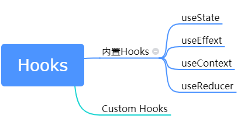

# Hooks

## 简介

1. 啥是Hooks？

   Hooks是一个function，这个function只能用在function组件里，它能让我们轻松挂钩state和lifecycle

2. 解决的痛点是什么？

   1. 组件之间重用与状态相关的逻辑很麻烦
   2. 复杂组件难以理解
   3. Class把人搞得头大

Hooks大致可以分成2种，一种是react内置的Hooks，一种是开发人员编写的Custom Hooks

内置的Hooks有很多种，最常用的是两个，一个是useState，一个是useEffect

### useState

### useEffect

为什么叫useEffect呢，effect的意思是“作用”，比如说纯函数是没用副作用（side effect）的，比如说一个在一个组件componentDidUpdate之类的生命周期方法内去fetch数据，订阅某些内容，改变DOM等等，这些操作是有副作用的。因为这些操作改变或影响其他组件，并且这些操作不能在render的时候去做。

