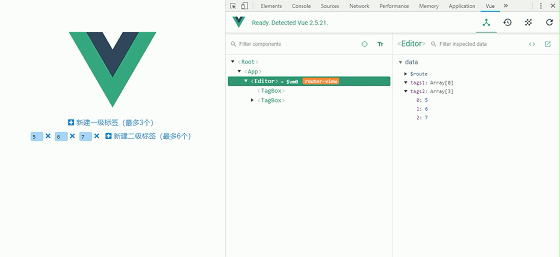

# v-model

要求实现这么一个组件

```html
<label-input v-model="name">姓名</label-input>
```

渲染出来的html如下，并实现input的value和变量name的双向绑定。

> 这是一段音乐

```html
<label>
	姓名
	<input type="text">
</label>
```

[参考：自定义事件](https://cn.vuejs.org/v2/guide/components-custom-events.html#%E8%87%AA%E5%AE%9A%E4%B9%89%E7%BB%84%E4%BB%B6%E7%9A%84-v-model)

## 关于事件名

请始终使用短横线命名法

## 表单元素

通常来说v-model只能用于表单元素

```html
<div id="v-model-0">
  <p>示例：如何在原生HTML组件上使用v-model</p>
  <input type="text" v-model="bar">
  <span>{{bar}}</span>
</div>
```

```js
var vmodel0 = new Vue({
  el: '#v-model-0',
  data() {
    return {
      bar: ''
    }
  }
})

```

使用v-model以后，表单元素和js变量之间就实现了双向绑定。

实际上，v-model就是一个语法糖

```html
<input v-model="someVar">
```

等价于

```html
<input
	:value="someVar"
	@input="someVar=$event.target.value"
>
```

## 自定义组件

自定义组件与原生表单元素有2点不同：

1. 表单元素默认存在value属性
2. 表单元素默认监听input事件

label-input是一个自定义组件，我们把它拿来假装表单元素，所以就要给它一个value属性，并且监听input事件。代码如下

```html
<div id="v-model-1">
  <p>示例：如何在自定义组件上使用v-model</p>
  <p>
    <label-input-1 v-model="name">姓名</label-input-1>
    <span>{{name}}</span>
  </p>
  <p>
    <label-input-1 :value="pwd" @input="pwd=$event">密码</label-input-1>
    <span>{{pwd}}</span>
  </p>
</div>
```

```js
var vmodel1 = new Vue({
  el: '#v-model-1',
  data() {
    return {
      name: '',
      pwd: ''
    }
  },
  components: {
    'label-input-1': {
      template: `
      <label>
        <slot></slot>
        <input type="text" :value="value" @input="$emit('input', $event.target.value)">
      </label>`,
      props: {
        value: String
      }
    }
  }
})
```

v-model作为一个语法糖，在原生HTML元素和自定义组件上略有一些不同：

```html
<label-input v-model="name">姓名</label-input>

```

等价于

```html
<label-input :value="name" @input="name=$event">姓名</label-input>
// 在父级组件监听内部emit的事件的时候，我们可以通过 $event 访问到被抛出的值

```

或者：

```html
<label-input :value="name" @input="name=arguments[0]">姓名</label-input>
// arguments[0]也可以访问到被抛出的值

```

## model选项

假如说我们把label-input这么改一下也是可以的，我们把属性value换了名字叫value123，emit的事件也改成了input123

```html
<div id="v-model-2">
  <p>示例：如何在自定义组件上使用v-model</p>
  <p>
    <label-input-2 v-model="name">姓名</label-input-2>
    <span>{{name}}</span>
  </p>
  <p>
    <label-input-2 :value123="pwd" @input123="pwd=$event">密码</label-input-2>
    <span>{{pwd}}</span>
  </p>
</div>

```

```js
var vmodel2 = new Vue({
  el: '#v-model-2',
  data() {
    return {
      name: '',
      pwd: ''
    }
  },
  components: {
    'label-input-2': {
      template: `
      <label>
        <slot></slot>
        <input type="text" :value="value123" @input="$emit('input123', $event.target.value)">
      </label>`,
      props: {
        value123: String
      }
      // 待加入的model选项
    }
  }
})

```

像上面这么写，“密码”一栏可以正常工作，而“姓名”一栏是不能正常工作的。这是因为当前v-model关心的是叫作value的属性和input的事件，他不认识value123和input123；现在我们通过model选项告诉v-model：你关心的value123和input123！

```js
var vmodel2 = new Vue({
  el: '#v-model-2',
  data() {
    return {
      name: '',
      pwd: ''
    }
  },
  components: {
    'label-input-2': {
      template: `
      <label>
        <slot></slot>
        <input type="text" :value="value123" @input="$emit('input123', $event.target.value)">
      </label>`,
      props: {
        value123: String
      },
      model: {
        prop: 'value123',
        event: 'input123'
      }
    }
  }
})

```

这样姓名一栏就能正常工作了。

## 监听自定义组件的原生事件

在组件上使用 v-on 只会监听自定义事件 (组件用 $emit 触发的事件)。如果要监听根元素的原生事件，应使用 .native 修饰符。

但是`.native` 监听器在类似下面这样的一个 **“input包裹器” **， `<base-input>` 中将静默失败，它不会产生任何报错，但是 `onFocus` 处理函数不会如你预期地被调用。

```html
<label>
  {{ label }}
  <input
    v-bind="$attrs"
    v-bind:value="value"
    v-on:input="$emit('input', $event.target.value)"
  >
</label>

```

对于类似 `<input>` 的你希望它也可以配合 `v-model` 工作的组件来说，为这些监听器创建一个类似下述 `inputListeners` 的计算属性通常是非常有用的。

```js
var vmodel3 = new Vue({
  el: '#v-model-3',
  data() {
    return {
      name: '',
      pwd: ''
    }
  },
  components: {
    'label-input-3': {
      inheritAttrs:false,
      props: {
        value123: String
      },
      computed: {
        inputListeners () {
          var vm = this
          return Object.assign({}, this.$listeners, {
            input: function (e) {
              vm.$emit('input123', e.target.value)
            }
          })
        }
      },
      template: `
      <label>
        <slot></slot>
        <input type="text" v-bind="$attrs" v-on="inputListeners" :value="value123">
      </label>`,
      model: {
        prop: 'value123',
        event: 'input123'
      }
    }
  }
})

```

说明：

### inheritAttrs:false 和 v-bind="$attrs"

inheritAttrs:false 的意思是“禁用特性继承”

一般来说子组件都应该把父组件将要传过来特性写到prop里面去，但是有时候组件库的作者并不总能预见组件将要接收什么值，所以子组件上可能写了一些特性，而这些特性在prop中没有定义。这些特性就叫<span style="background:yellow">非prop特性</span>。

Vue在设计的时候考虑到了这一点，所以组件可以接受任意的特性而不报错，并且**Vue将把非prop特性加到组件根元素上**。但这种考虑并不总是开发者想要的，有时候开发者并不想把这些特性加到根元素上，而是其他元素上：

1. 此时使用inheritAttrs:false就能达到**“不把这些特性加到根元素上”**的目的。
2. 那么**“把特性加到其他元素上”**的目的如何实现呢？对，就是使用v-bind="$attrs"。我们知道，v-bind可以接受一个对象，对象是所有属性就是bindings，而\$attrs正是一个包含了<span style="background:yellow">父作用域中除了class和style的所有非prop特性</span>的对象，所以通过 v-bind="\$attrs" 就可以将传入内部组件。

使用过 v-bind="\$attrs" 以后也还是可以在添加bindings的。

### vm.$listeners

Vue 提供了一个 `$listeners` 属性，它是一个对象，里面包含了作用在这个组件上的所有监听器。

## 实际使用

[代码地址](https://github.com/JiWeiZ/v-model)



这是一个多标签组件\<tag-box\>，可以设定最大标签数

```html
<tag-box v-model="tags1" :maxTagNum="3">新建一级标签（最多3个）</tag-box>
<tag-box v-model="tags2" :maxTagNum="6">新建二级标签（最多6个）</tag-box>

```

v-model绑定一个数组，可根据数组长度length生成length个输入组件<tag-input\>

```js
data () {
  return {
    tags1: [],
    tags2: [5, 6, 7]
  }
}

```

输入组件<tag-input\>是对原生表单元素input的包装：

1. 长度可以根据输入内容的大小变化
2. 输入时键入回车可以新增一个新标签，键入删除或退格删除标签
3. 失去焦点时，若输入内容为空，则删除标签


