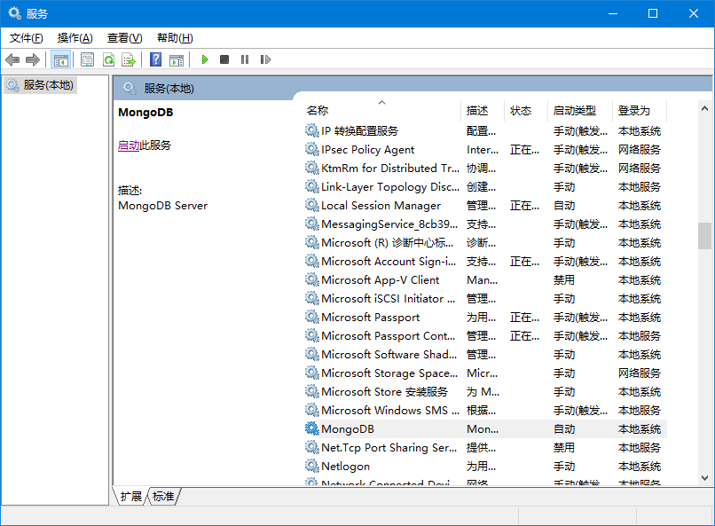

# 安装和使用mongodb

现在MongoDB已经发布了4.0版本，但是由于上一个项目使用的是3.0版本的mongodb，所以考虑还是以3.0的为主

## 一、下载MongoDB

官网下载安装

## 二、配置MongoDB

1. 在c:\MongoDB（可随意起）下面建一个data文件夹 c:\MongoDB\data

2. 在c:\MongoDB（可随意起）下面建一个logs文件夹 c:\MongoDB\logs ，在里面建一个文件mongo.log

3. 在c:\MongoDB（可随意起）下面建一个etc(随意起，放配置文件)文件夹 c:\MongoDB\etc ,在里面建一个文件mongo.conf

4. 打开mongo.conf文件，修改如下：

   ```bash
   #数据库路径
   dbpath=c:\MongoDB\data\
   
   #日志输出文件路径
   logpath=c:\MongoDB\logs\mongodb.log
   
   #错误日志采用追加模式，配置这个选项后mongodb的日志会追加到现有的日志文件，而不是从新创建一个新文件
   logappend=true
   
   #启用日志文件，默认启用
   journal=true
   
   #这个选项可以过滤掉一些无用的日志信息，若需要调试使用请设置为false
   quiet=false
   
   #端口号 默认为27017
   port=27017
   
   #指定存储引擎（默认先不加此引擎，如果报错了，大家在加进去）
   #storageEngine=mmapv1
   
   httpinterface=true
   ```

5. 配置环境变量

6. 设置windows服务，首先进入命令行

   ```bash
   mongod --config c:\MongoDB\etc\mongo.conf --install --serviceName "MongoDB"
   ```

   然后打开windows服务，点击启动，启动mongoDB

   
